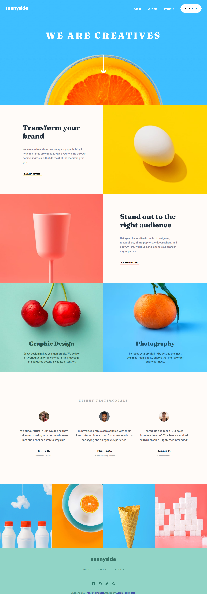

# Frontend Mentor - Sunnyside agency landing page solution

This is a solution to the [Sunnyside agency landing page challenge on Frontend Mentor](https://www.frontendmentor.io/challenges/sunnyside-agency-landing-page-7yVs3B6ef). Frontend Mentor challenges help you improve your coding skills by building realistic projects.

## Table of contents

- [Overview](#overview)
  - [The challenge](#the-challenge)
  - [Screenshot](#screenshot)
  - [Links](#links)
- [My process](#my-process)
  - [Built with](#built-with)
  - [What I learned](#what-i-learned)
  - [Continued development](#continued-development)
- [Author](#author)

## Overview

### The challenge

Users should be able to:

- View the optimal layout for the site depending on their device's screen size
- See hover states for all interactive elements on the page

### Screenshot

### Links

- [Solution URL](https://www.frontendmentor.io/solutions/sunnyside-landing-page-using-responsive-css-fJ8gvd8GbS)
- [Live Site URL](https://aarontark.github.io/Sunnyside-Agency-Landing-Page/)

## My process

### Built with

- Semantic HTML5 markup
- CSS custom properties
- Flexbox
- CSS Grid
- Mobile-first workflow
- Dynamic font sizes

### What I learned

I used this project to experiment with the clamp property and some responsive techniques. I set clamp on things that I wanted to scale with the viewport, and I was more mindful of what units I used where (such as em for padding and margin and rem for font-sizes).

I also learned ways to optimize your site, such as converting images from jpg or png to webp (though I couldn't get around to doing this).

### Continued development

I would like to continue to learn responsive design, reinforce CSS fundamentals, and begin learning Javascript in depth.

## Author

- Frontend Mentor - [@aarontark](https://www.frontendmentor.io/profile/aarontark)

